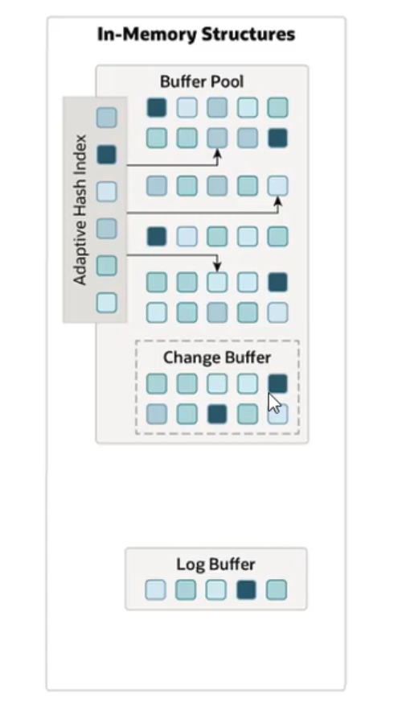

##  逻辑存储结构
1、 InnoDB存储结构图如下:
    
**_表空间(Tablespace)_**: idb文件，一个mysql实例可以对应多个表空间，用于存储记录、索引等数据。    

**_Segment(段)_**: 分为数据段(Leaf node segment)、索引段(Non-leaf node segment)、回滚段(Rollback segment)，
InnoDB是索引组织表，数据段就是B+数的叶子节点，索引段即为B+树的非叶子节点。段用来管理多个Extent(区)。      

**_Extent(区)_**: 表空间的单元结构，每个区的大小为1M。默认情况下，InnoDB存储引擎页大小为16KB，即每个Extent为16KB。，即一个区中一共有64个连续页。    

**_Page(页)_**: 是InnoDB存储引擎磁盘管理的最小单位，每个页的大小默认为16KB。为了保证页的连续性，InnoDB存储引擎每次从磁盘申请4~5个区。       

**_Row(行)_**: InnoDB存储引擎数据是按照 行 进行存放的。    

**_Trx_id_**：每次对某条记录进行改动时，都会把对应的事务id赋值给trx_id隐藏列。    

**_Roll_pointer_**：每次对某条记录进行改动时，都会把旧的版本写入到undo日志中，然后这个隐藏列就相当于一个指针，可以通过它来找到记录修改前的信息。    

## 架构
> Mysql5.5版本开始，默认使用InnoDB存储引擎，它擅长事务处理，具有崩溃恢复特性，在日常开发中使用非常广泛。   

下面是InnoDB架构图，左侧为内存结构，右侧为磁盘结构。    

## 内存架构  

**_Buffer Pool_**：缓冲池是主内存中的一个区域，里面可以缓存磁盘上经常操作的真实数据，在执行增删改查操作时，先操作缓冲池中的数据(若缓存池中没有，则从磁盘中加载并缓存),然后再以一定频率刷新到磁盘，从而减少磁盘IO，加快处理速度。   
> 缓冲池以Page为单位，底层采用链表数据结构管理Page。根据状态，将Page分为三种类型：
>> free page: 空闲页，未被使用。
> 
>> clean page: 被使用page，数据没有修改过
> 
>> dirty page: 脏页，被使用page，数据被修改过，也就是缓存中的数据和磁盘中的数据产生了不一致。

**_change buffer_**：更改缓冲区(针对于非唯一的二级索引页)，在执行DML语句时，如果这些数据Page没有在Buffer Pool中，不会直接操作磁盘，而会将数据变更存在更改缓存区Change Buffer中，在未来数据被读取时，再将数据合并恢复到Buffer Pool中，再将合并后的数据刷新到磁盘中。
> change buffer的意义是什么
>> 与聚集索引不同，二级索引通常是非唯一的，并且以相对随机的顺序插入二级索引。
>> 同样，删除和更新可能会影响索引树中不相邻的二级索引页，如果每一次都操作盘，会造成大量的磁盘IO。
>> 有了ChangeBuffer之后，我们可以再缓冲池中进行合并处理，减少磁盘IO。

**_Adaptive Hash Index_**：自适应hash索引，用于优化对于Buffer Pool数据的查询。InnoDB存储引擎会监控对表上各索引页的查询，如果观察到hash索引可以提升速度，则建立hash索引，称之为自适应hash索引。   
> 自适应hash索引，无需人工干预，是系统根据情况完成的。  参数：adaptive_hash_index 

**_Log Buffer_**：日志缓冲区，用来保存写入到磁盘中的log日志数据(redo log、undo log)，默认大小为16MB，日志缓冲区的日志会定期刷新到磁盘。如果需要更新、插入或者删除多行操作的事务，增加日志缓冲区的大小可以减少磁盘IO。    
> 参数
>>innodb_log_buffer_size：缓冲区大小
> 
>>innodb_flush_log_at_trx_commit：日志刷新到磁盘时机。1代表每次提交事务时写入并刷新到磁盘，0代表每秒将日志写入并刷新到磁盘一次，2代表每次事务提交后写入，并每秒刷新到磁盘一次    

## 磁盘架构

**_System Tablespace_**：系统表空间是更改缓冲区的存储区域。如果表是在系统表空间而不是每个表文件或通用表空间中创建的，他也可能包含表和索引数据。(在Mysql5.X版本中还包含InnoDB数据字典、undolog等)
> 参数：innodb_data_file_path

**_File-Per-Table Tablespaces_**：每个表的文件表空间包含单个InnoDB表的数据和索引，并存储在文件系统上的单个数据文件中。  
> 参数：innodb_file_per_table

## 后台线程

> 作用：在合适的时机，将InnoDB缓冲池的数据刷新到磁盘文件中

**_Master Thread_**：核心后台线程，负责调度其他线程，还负责将缓冲池中的数据异步刷新到磁盘中，保持数据的一致性，还包括脏页的刷新、合并插入缓存、undoye的回收

**_IO Thread_**：在InnoDB存储引擎中大量使用AIO(异步IO)来处理IO请求，这样可以极大的提高数据库的性能，而IO Thread主要负责这些IO请求的调度

**_Purge Thread_**：主要用于回收事务已经提交的undo log，在事务提交后，undo log可能不用了，就用它来回收

**_Page Cleaner Thread_**：协助Master Thread刷新脏页到磁盘中的线程，它可以减轻 Master Thread的工作压力，减少阻塞。

## 事务原理   

**_事务_**：是一组操作的集合，他是一个不可分割的工作单位，事务会把所有操作作为一个整体一起向系统提交或者撤销操作请求，即这些操作要么同时成功，要么同时失败。   
>特性：ACID
>> 原子性：事务是不可分割的最小操作单位，要么全部成功，要么全部失败。
> 
>> 一致性：事务完成时，必须使所有的数据都保持一致状态
> 
>>  隔离性：数据库系统提供的隔离机制，保证事务在不受外部并发操作影响的独立环境下运行。
> 
>> 持久性：事务一旦提交或者回滚，他对数据库中数据的改变时永久的。

## redo log
> redo log，解决事务持久化的时候存在的问题，确保了事务的持久性。
>> redo log 也叫重做日志，记录的是事务提交时数据也的物理修改，是用来实现事务的持久性的。   
>
>> 该日志文件由两部分组成：重做日志缓冲以及重做日志文件，前者是在内存中，后者是在磁盘中。当事务提交之后会把所有修改信息都存到该日志文件中，用于在刷新脏页到磁盘，发生错误时，进行数据恢复使用。   

> 
> 根据流程图可知：数据库在进行增删改的操作时的流程
>> 1、先到缓冲池中找到相应的数据，如果缓冲池中不存在相应的数据，则通过磁盘文件中找到相应的数据，并把数据加载到缓冲池中。然后再对缓存数据进行操作，操作完成提交后的一段时间，再把提交后的缓存数据刷新到磁盘文件。这样的目的是为了减少数据库对磁盘IO的随机读写，提高数据库的性能。
> 
>>2、如果事务提交后，在把缓存池中的数据刷新到磁盘的时候，发生故障，这就导致缓存的数据不能成功的持久化到磁盘中，就不能保证事务的持久性了。这是就增加了redo log 重做日志，redo log 在缓存池中的数据发生增删改后，会把相应的增删改的数据页(也就是脏页数据)，复制一份到redolog buffer中，并且通过异步的形式，把redo log buffer中的数据刷新到磁盘的redolog 文件中，当buffer pool(缓冲池)的数据刷新到磁盘的时候，发生故障时，就可以通过redo log文件来恢复数据。

## undo log
> undo log，解决事务原子性问题的
>> undo log，也叫回滚日志，用于记录数据被修改前的信息，作用包含两个：提供回滚和MVCC(多版本并发控制).
>
>> undolog和redolog记录的物理日志不一样，undolog 是逻辑日志。可以认为当delete一条记录时，ubdo log中会记录一条对应的insert记录，反之亦然，当update一条记录时，它记录一条相应相反的insert记录。当执行rollback时，就可以从undo log中的逻辑记录读取到相应的内容并进行回滚。
> 
>> undo log销毁：undo log在事务执行时产生，事务提交时，并不会立即删除undolog，因为这些日志还用于MVCC。
> 
>> undo log存储：undo log采用段的方式进行管理和记录，存放在前面内容介绍的 rollback segment回滚段中，内容包含1024个undo log segment。

## MVCC
> MVCC(多版本并发控制)，指维护一个数据的多个版本，使得读写操作没有冲突，快照读为Mysql实现MVCC提供了一个非阻塞读功能。MVCC的具体实现，还需要依赖数据库记录中的三个隐式字段、undo log日志、readView。

**_当前读_**：读取的是记录最新版本，读取时还要保证其他并发事务不能修改当前记录，会对读取的记录进行加锁。对于我们日常的操作，如：select...lock in share mode(共享锁)，select...for update、insert、delete(排他锁)都是一种当前读。

**_快照读_**：简单的select(不加锁)就是快照读，快照读，读取的是记录数据的可见版本，有可能是历史数据，不加锁，是非阻塞读。
> Read Committed：每次select，都生成一个快照读。(这也导致可能存在不可重复和幻读，因为每次select的快照读都不一致，得到的结果可能也就不一样了) 
> 
> Repeatable Read：开始事务后第一个select语句才是快照读的地方。
> 
> Serializable：快照读会退化为当前读。

### MVCC-隐藏字段
mysql在创建表的时候，隐式创建的三个隐藏字段。

> 记录中的隐藏字段
>> 1、DB_TRX_Id：最近修改事务ID，记录插入这条记录或最后一次修改该记录的事务ID
> 
>> 2、DB_ROLL_PTR：回滚指针，指向这条记录的上一个版本，用于配合undo log，指向上一个版本。
> 
>> 3、DB_ROW_ID：隐藏主键，如果表结构没有指定主键，将会生成该字段

### MVCC-undo log 版本链
> undo log，回滚日志，在insert、update、delete的时候产生的便于回滚的日志。   
> 当insert的时候，产生的undo log日志只在回滚时需要，在事务提交后，可被立即删除。    
> 而update、delet的时候，产生的undo log日志不仅在回滚时需要，在快照读时也需要，不会立即被删除。     

**_undolog 版本链_**

一下用图文形式展示：

1、首先表中存在一条记录，此时的表记录如下

2、此时该表按照一下几个事务进行操作

3、事务2开启时，表记录和undolog日志的变化，如下下图：

  

4、事务2，执行修改id为30记录中的age为3时，undolog日志的变化和表记录的变化如下：

5、开始事务3时

6、事务4

> 由此可见，undo log 版本链，是不同事务或相同事务对同一条记录进行修改，会导致该记录的undo log生成一条记录版本链表，链表的头部是最新的旧纪录，链表尾部是最早的旧纪录。   

### readView
> readView，读视图是快照读SQL执行时MVCC提取数据的依据，记录并维护系统当前活跃的事务(未提交)id。
> 
> ReadView是事务开启时，当前所有活跃事务（还未提交的事务）的一个集合，ReadView数据结构决定了不同事务隔离级别下，数据的可见性。
> 
> readView中包含了四个核心字段：
> 
>> **_m_ids_**：当前活跃的事务ID集合
> 
>> **_min_trx_id_**：最小活跃事务ID
> 
>> **_max_trx_id_**：预分配事务ID，当前最大事务ID+1(因为事务ID是自增的)
> 
>> **_creator_trx_id_**：ReadView创建者的事务ID

readview，版本链数据访问规则：

> 不同的隔离级别，生成Readview的时机不同：
>> Read Committed：在事务中每一次执行快照读时生成Readview。
> 
>> Repeatable Read：在事务中第一次执行快照读时生成Readview,后续复用该Readview。

### RC级别
Read Committed隔离级别下，每次select，执行快照读时生成一个新的Readview。(这也导致可能存在不可重复和幻读，因为每次select的快照读都不一致，得到的结果可能也就不一样了)

执行流程：

按照上述2~4事务执行完之后，undu log产生的版本链如下：

1、当事务5执行第一次快照读的时候，得到的readview如下：

由上面的undo log的版本链可知  
当前记录标记的是trx_id(事务id)=4，根据版本链的访问规则:  
此时：trx_id=4,creator_trx_id=5,min_trx_id=3,max_trx_id=6,m_ids={3,4,5}    
**第一条**：trx_id==creator_trx_id不成立，    
**第二条**：trx_id<min_trx_id不成立，    
**第三条**：trx_id>max_trx_id=不成立，    
**第四条**：min_trx_id<trx_id<max_trx_id,但max_trx_id存在m_ids中,不成立。   
根据上述四条规则都不存在成立的，所以不返回当前undo log中版本trx_id=4的记录    
此时根据undo log 中的版本链，找到上一个版本，在进行上述的判断。   
最终得到当前记录的版本trx_id=2时，符合上述规则，所以此时查询得到的结果为：   
name=A30,age=3

2、当事务5执行第二次快照读的时候，得到的readview如下：

和上述的执行规则一样，同理符合上述规则的结果是，undolog 中版本trx_id=3的结果，所以此时查询得到的结果为：  
name=A3,age=3

### RR级别
Repeatable Read隔离级别下，在仅仅在事务中第一次执行快照读时生成ReadView，后续复用该ReadView。

## 总结

