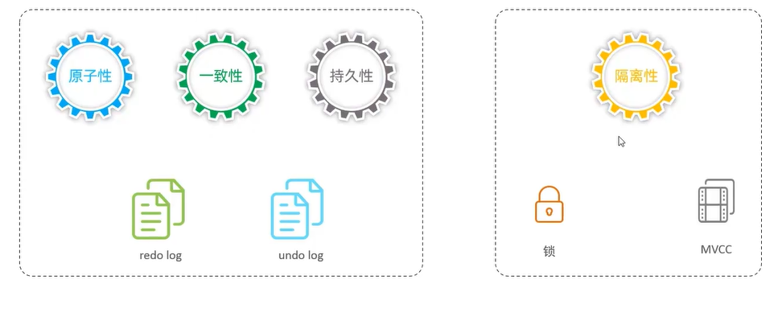

### 事务
事务 是一组操作的集合，它是一个不可分割的工作单位，事务会把所有的操作作为一个整体一起向系统提交或者撤销操作请求，即这些操作要么同时成功，要么同时失败。  
特性：  
原子性：事务时不可分割的最小操作单位，妖媚全部成功，要么全部失败。  
一致性：事务完成时，必须使所有的数据都保持一致性。  
隔离性：数据库系统提供的隔离机制，保证事务在不受外部并发操作影响的独立环境下运行。  
持久性：事务一旦提交或者回滚，他对数据中的数据的改变使永久的。 
  
* **redolog--->如何实现持久性**  
redolog 称为重做日志，记录的使事务提交时数据页的物理修改，是用来实现事务的持久性。  
该日志文件由两部分组成：重做日志缓冲(redo log buffer) 以及重做日志文件(redo log file),前者是在内存中，后者是在磁盘中。当事务提交之后会把所有修改信息都存到该日志文件中，用于在刷新脏页到磁盘，发生错误时，进行数据恢复使用。
* **redolog--->如何实现原子性**  
> 回滚日志：用于记录数据被修改前的信息，作用包含两个：提供回滚和MVCC(多版本并发控制)。  
> undo log 和 redo log 记录物理日志不一样，他是逻辑日志。可以认为当delete一条记录时，undo log 中会记录一条对应的insert 记录，反之亦然，当update一条记录时，它记录一条对应相反的update记录。当执行rollback时，就可以从undo log 中的逻辑记录读取到相应的内容并进行回滚。
>> undo log销毁：undo log 在事务执行时产生，事务提交时，并不会立即删除 undo log，因为这些日志可能还用于MVCC  
>> undo log 存储：undo log采用段的方式进行管理和记录，存放在前面介绍的rollback segment 回滚段中，内部包含1024个undo log segment
