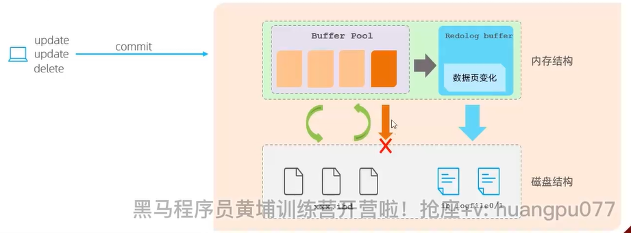

### 事务
事务 是一组操作的集合，它是一个不可分割的工作单位，事务会把所有的操作作为一个整体一起向系统提交或者撤销操作请求，即这些操作要么同时成功，要么同时失败。   
特性：  
原子性：事务时不可分割的最小操作单位，妖媚全部成功，要么全部失败。  
一致性：事务完成时，必须使所有的数据都保持一致性。  
隔离性：数据库系统提供的隔离机制，保证事务在不受外部并发操作影响的独立环境下运行。  
持久性：事务一旦提交或者回滚，他对数据中的数据的改变使永久的。

> 如何保证事务的原子性、一致性、隔离性、持久性  
主要是由innoDB存储引擎中的两份日志保证的，分别是redo log和undo log。  
隔离性：主要是由锁机制、MVCC（多版本并发控制实现的）

  
* **redolog--->如何实现持久性(属于物理日志)**  
redolog 称为重做日志，记录的是事务提交时数据页的物理修改，是用来实现事务的持久性。  
该日志文件由两部分组成：重做日志缓冲(redo log buffer) 以及重做日志文件(redo log file),  
前者是在内存中，后者是在磁盘中。当事务提交之后会把所有修改信息都存到该日志文件中，用于在刷新脏页到磁盘，发生错误时，进行数据恢复使用。  
原理图如下：  
mysql的InnoDB默认分为内存结构(Buffer Pool)和磁盘结构，  
当客户端提交一个事务操作时,并且该事务存在多条update、delete等操作时，  
默认会先操作缓冲区的数据，  
如果缓冲区不存在待修改的数据，  
先通过后台线程从磁盘中读取数据到缓冲区当中，然后直接在缓冲区当中操作数据的更改，   
如果缓冲区存在待修改的数据，  
那么则会直接修改缓冲区当中的数据，  
此时，虽然缓冲区的数据已经修改，但磁盘当中的数据时尚未更新的，  
这时缓冲区的数据页我们称之为脏页，  
然后在一定的时机，通过后台线程将缓冲区当中的数据刷新到磁盘当中，  
如果此时执行的流程成功后，那么缓冲区和磁盘的数据就会一致。  
这时就会存在一个问题，脏页的数据并不是实时刷新的，  
如果在刷新到磁盘的时候，出错了，就会导致内存中的数据不能成功的刷新到磁盘当中。这是持久性则得不到保障  
此时引入redolog buffer  
当对缓存区的数据进行怎删改的时候，首先会把增删改的数据，记录在redulog buffer中，  
当事务提交的时候，会直接将redolog buffer中的数据刷新到redolog file的磁盘文件中,  
当进行脏页的数据刷新的时候，如果出错了，那么此时就可以通过redolog file进行回滚。
这种机制WAL(write ahead log)就是先写日志，再进行数据修改，这样保证持久性。

> 作用
>> redolog日志，为了保证进行脏页刷新的时候发生错误进行恢复，从而保证了数据的持久性

* **undolog--->如何实现原子性(属于逻辑日志)**  
> 回滚日志：用于记录数据被修改前的信息，作用包含两个：提供回滚和MVCC(多版本并发控制)时，提供找到历史版本。  
> undo log 和 redo log 记录物理日志不一样，他是逻辑日志。  
> 可以认为当delete一条记录时，undo log 中会记录一条对应的insert 记录，  
> 反之亦然，当update一条记录时，它记录一条对应相反的update记录。  
> 当执行rollback时，就可以从undo log 中的逻辑记录读取到相应的内容并进行回滚。
>> undo log销毁：undo log 在事务执行时产生，事务提交时，并不会立即删除 undo log，因为这些日志可能还用于MVCC  
>> undo log 存储：undo log采用段的方式进行管理和记录，存放在前面介绍的rollback segment 回滚段中，内部包含1024个undo log segment
